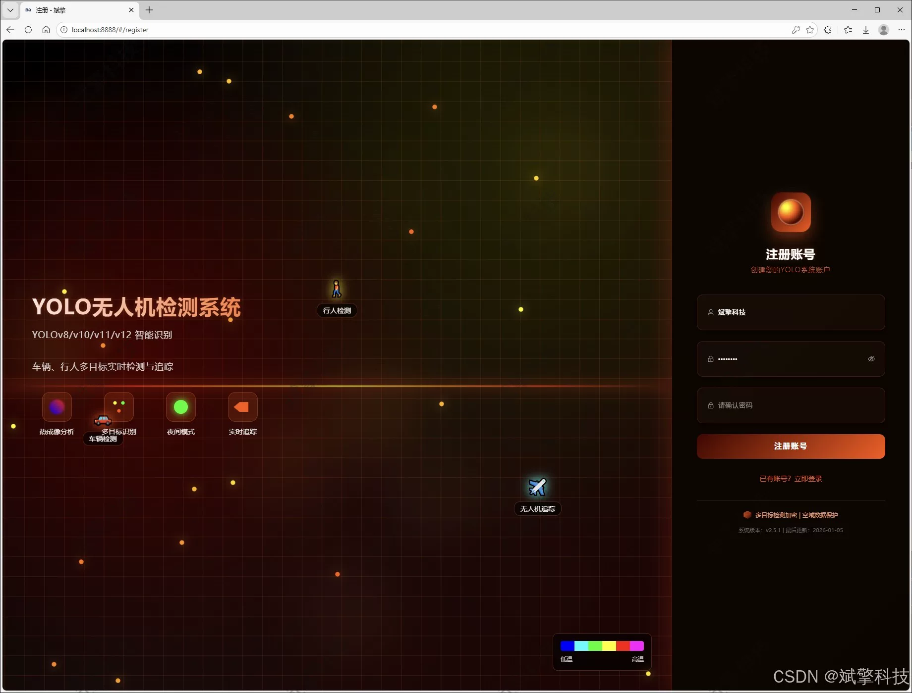
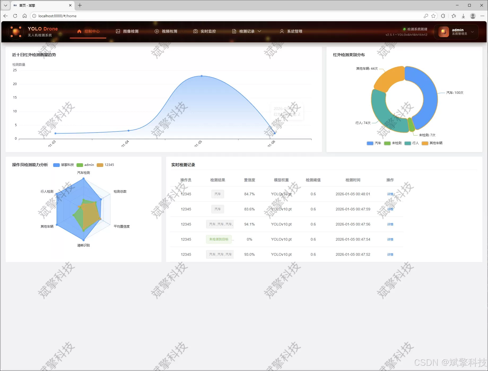
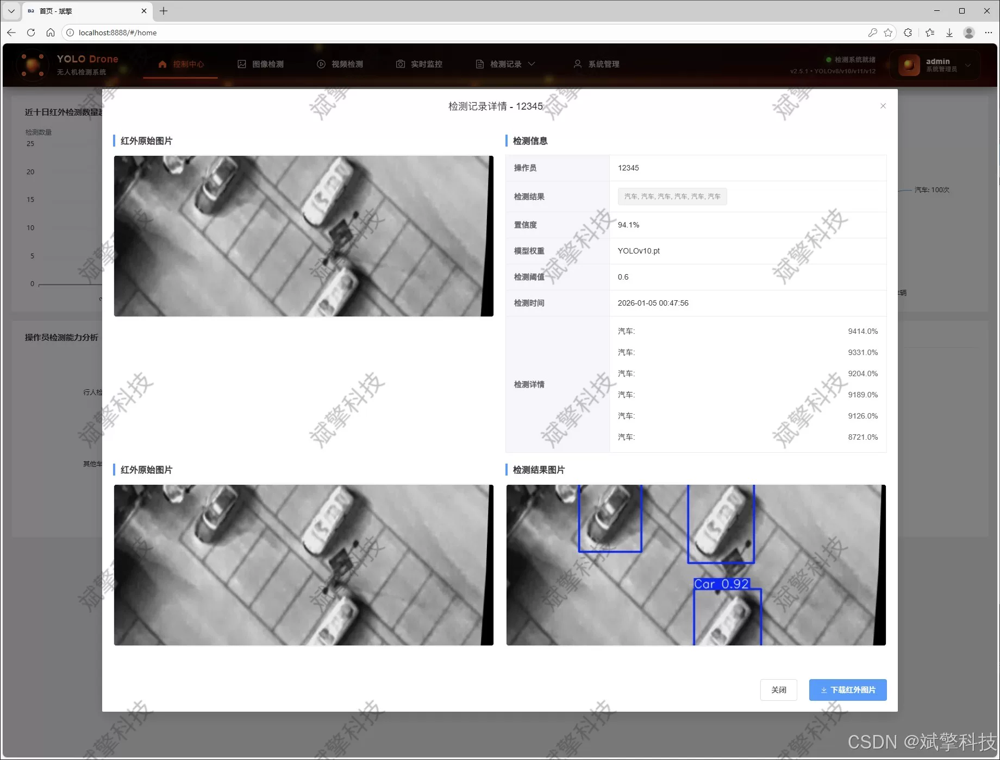
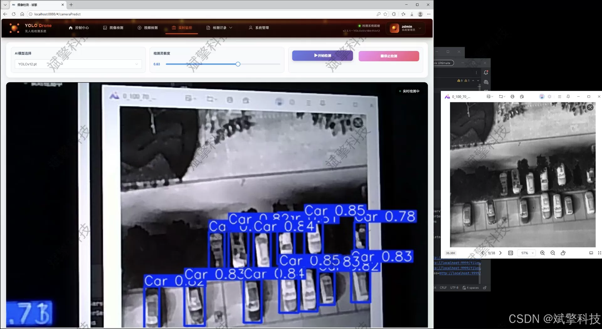
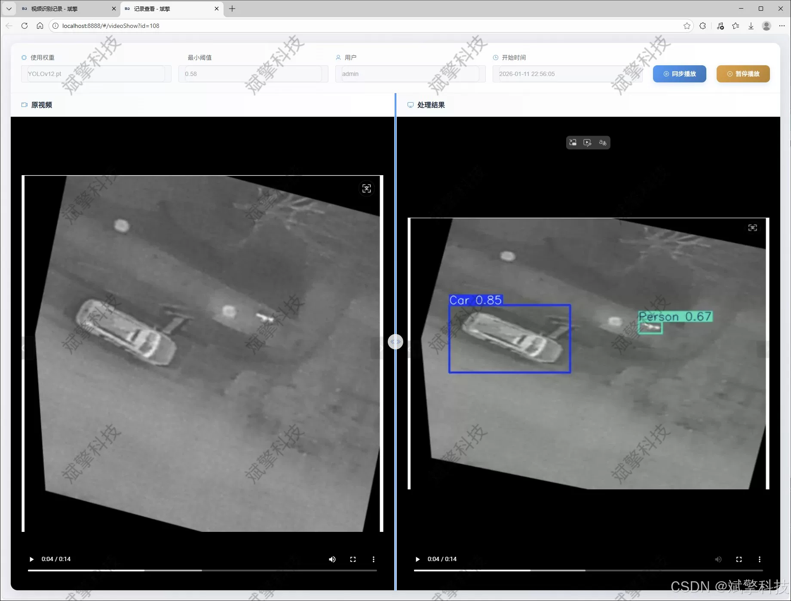
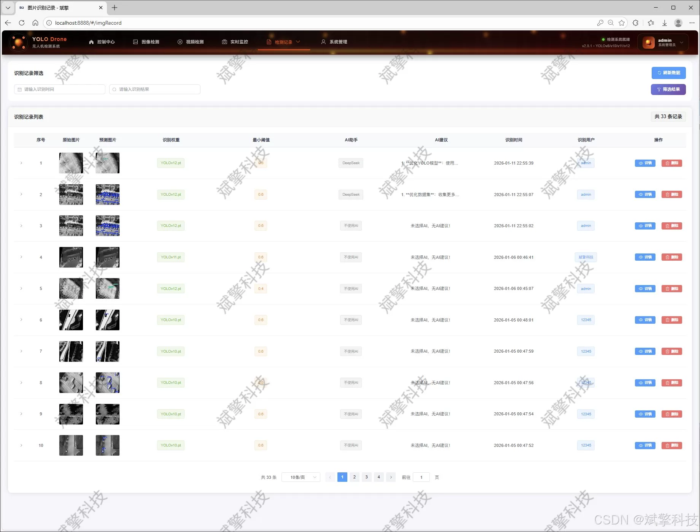
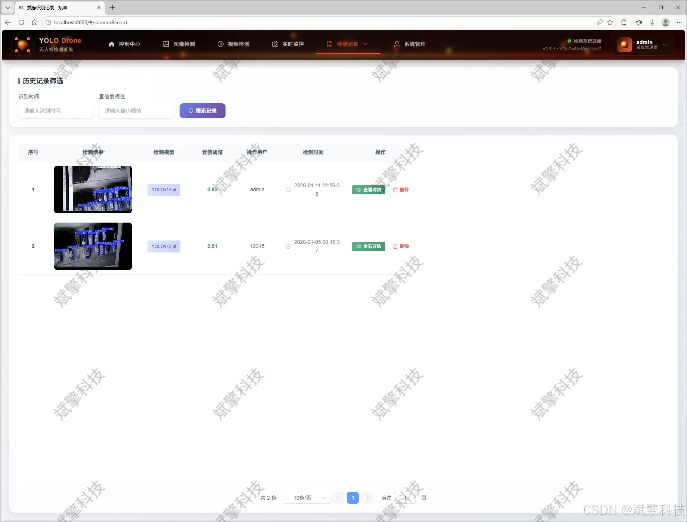
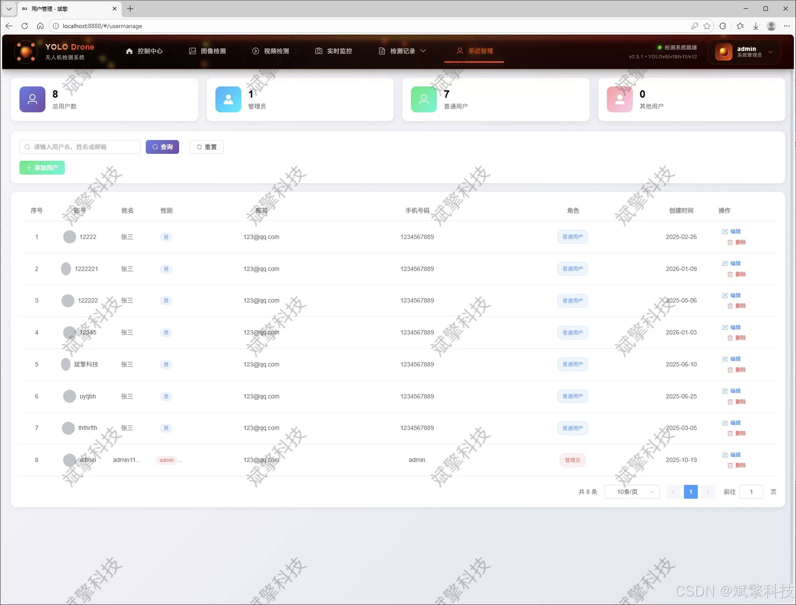
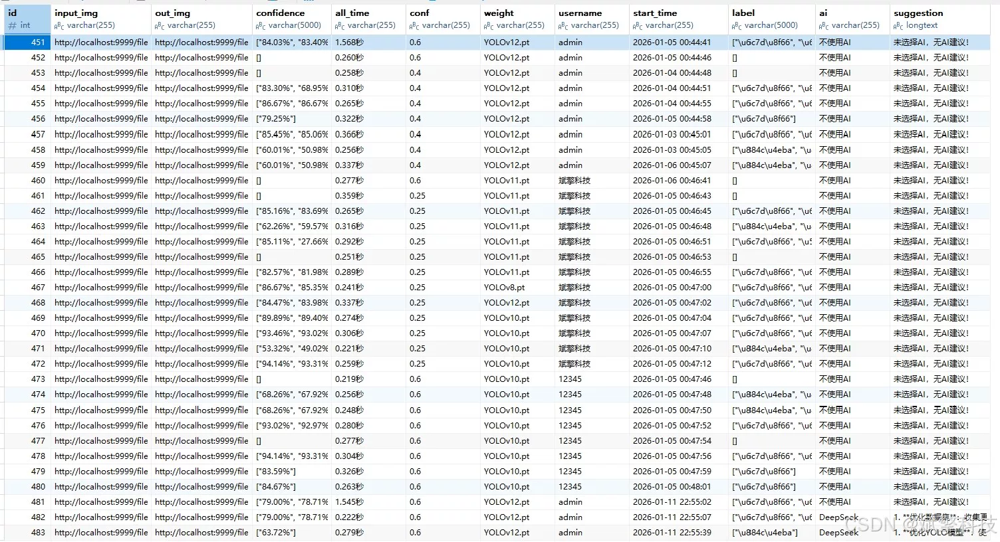

# YOLO Multi-Model Drone Detection System

## Body

The YOLO multi-model drone detection system is based on the YOLO deep learning and the large models of Qianwen and DeepSeek. The drone detection system (DeepSeek intelligent analysis + web interaction interface + front-end separation + YOLO data + YOLOv8/YOLOv10/YOLOv11/YOLOv12)

With the popularization of drone technology and the continuous expansion of its application fields, it plays an increasingly important role in urban management, traffic monitoring, emergency rescue, and other aspects. However, the issues of privacy security and air traffic management have become more prominent. There is a pressing need for a high-efficiency, precise drone-borne visual target detection system. This project designs and implements an intelligent drone monitoring system that integrates cutting-edge deep learning object detection models with modern Web technologies.

The core of the system is to build a multi-model compatible YOLO object detection engine, seamlessly integrating four advanced single-stage detection algorithms: YOLOv8, YOLOv10, YOLOv11, and YOLOv12. This allows users to flexibly switch between models based on their different needs for speed and accuracy in real-time scenarios. The detection targets are focused on four common objects in urban low-altitude environments: vehicles (Car), pedestrians (Person), other vehicles (OtherVehicle), and background/ignored areas (DontCare). The system is trained and validated based on a self-built dataset containing over ten thousand images (training set 10,128, validation set 715, test set 355), ensuring the robustness and generalization ability of the model in real scenarios.

The backend is built with SpringBoot framework, and the frontend provides an intuitive Web interaction interface. The system uses a MySQL database for efficient persistent management of user information and detection records. The system has comprehensive functions, supporting image upload detection, video file analysis, and real-time camera stream detection. All detection results (including target category, confidence, location, and timestamp) are automatically saved to the database for subsequent traceability and statistical analysis. In addition, this project innovatively integrates the intelligent analysis function of DeepSeek large language model, which can understand the context and generate more rich and humanized report analysis, greatly improving the level of intelligent interaction in the system.

Functional module

✅ User Login and Registration: Supports password detection, saves to MySQL database.

✅ Supports four YOLO model switches, YOLOv8, YOLOv10, YOLOv11, YOLOv12.

✅ Information Visualization, Data Visualization.

✅ Image detection supports AI analysis functions, deepseek and Qianwen.

✅ Supports image detection, video detection, and real-time camera detection. The results are saved to a MySQL database.

✅ Picture recognition record management, video recognition record management and camera recognition record management.

✅ User Management Module, administrators can add, delete, modify, and query users.

✅ Personal center, can modify their own information, password name profile picture and so on.

There is no Lunwen writing service, nor any Lunwen.

## Images

## Payment

Here is a pay link on Stripe ( https://buy.stripe.com/3cs8yP7sY87d0vu9AB ). Please contact me lonlonago@foxmail.com after funding $89, and I will send you a complete data files , thank you!

